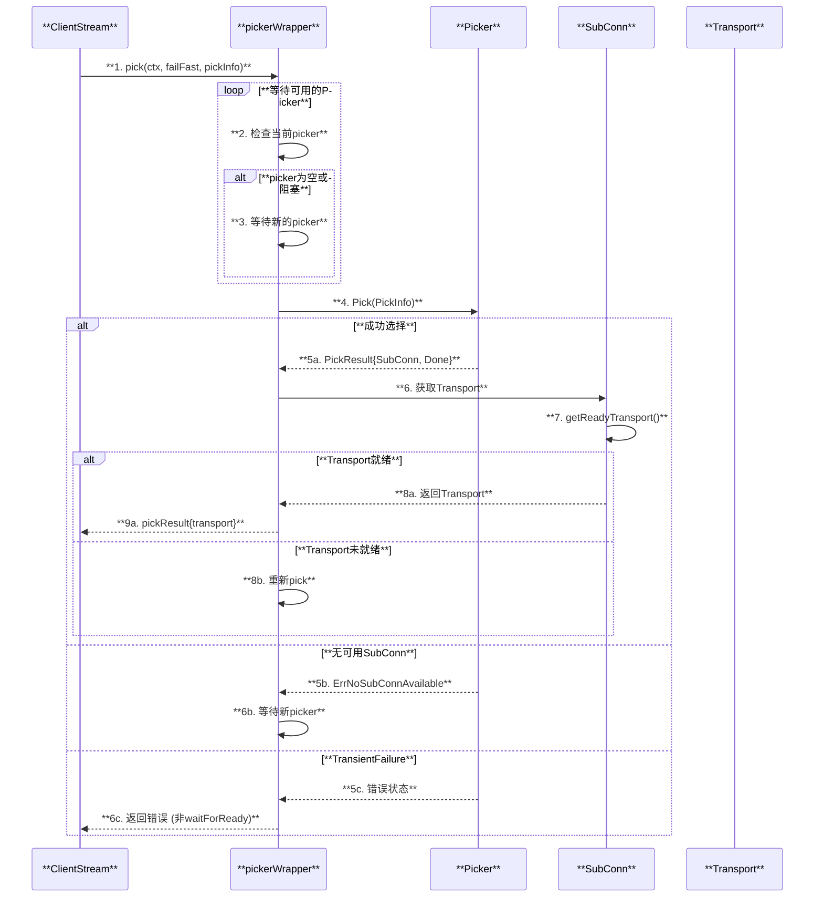

# gRPC-Go 架构深度解析

## 目录
1. [概述](#概述)
2. [核心架构](#核心架构)
3. [核心组件](#核心组件)
4. [客户端架构](#客户端架构)
5. [服务端架构](#服务端架构)
6. [负载均衡与解析器](#负载均衡与解析器)
7. [传输层](#传输层)
8. [RPC调用流程](#rpc调用流程)
9. [函数调用链](#函数调用链)
10. [性能特性](#性能特性)

---

## 概述

gRPC-Go 是 gRPC 的 Go 语言实现，提供高性能、跨语言的 RPC 框架。它基于 HTTP/2 协议，使用 Protocol Buffers 作为接口定义语言（IDL）和序列化格式。

### 核心特性
- **HTTP/2 传输**: 多路复用、流控制、头部压缩
- **服务发现与负载均衡**: 可插拔的 Resolver 和 Balancer
- **拦截器支持**: 客户端和服务端的 Unary/Stream 拦截器链
- **安全传输**: TLS/mTLS 支持
- **流式RPC**: 支持 Unary、Server Streaming、Client Streaming、Bidirectional Streaming

---

## 核心架构


---

## 核心组件

### 组件关系图


### 核心数据结构

| **组件** | **文件位置** | **职责** |
|---------|-------------|---------|
| **ClientConn** | `clientconn.go` | 管理客户端连接、解析器、负载均衡器 |
| **Server** | `server.go` | 管理服务端、监听器、连接处理 |
| **addrConn** | `clientconn.go` | 管理单个地址的连接 |
| **ccResolverWrapper** | `resolver_wrapper.go` | 包装 Resolver，处理地址解析 |
| **ccBalancerWrapper** | `balancer_wrapper.go` | 包装 Balancer，处理负载均衡 |
| **http2Client** | `internal/transport/http2_client.go` | HTTP/2 客户端传输实现 |
| **http2Server** | `internal/transport/http2_server.go` | HTTP/2 服务端传输实现 |

---

## 客户端架构

### ClientConn 结构


### 客户端连接建立时序图


---

## 服务端架构

### Server 结构


### 服务端请求处理时序图


---

## 负载均衡与解析器

### Resolver 工作机制


### Balancer 工作机制


### 负载均衡选择流程



---

## 传输层

### HTTP/2 传输架构


### HTTP/2 帧处理

| **帧类型** | **用途** | **处理函数** |
|-----------|---------|-------------|
| **HEADERS** | 请求/响应头 | `handleHeaders()` |
| **DATA** | 消息数据 | `handleData()` |
| **RST_STREAM** | 流重置 | `handleRSTStream()` |
| **SETTINGS** | 设置协商 | `handleSettings()` |
| **PING** | 心跳检测 | `handlePing()` |
| **GOAWAY** | 优雅关闭 | `handleGoAway()` |
| **WINDOW_UPDATE** | 流控更新 | `handleWindowUpdate()` |

---

## RPC调用流程

### Unary RPC 完整时序


---

## 函数调用链

### 客户端 Unary RPC 调用链

```text
ClientConn.Invoke() - clientconn.go:29
├── 合并 CallOptions
│   └── combine(cc.dopts.callOptions, opts) - call.go:40
├── 拦截器处理
│   └── cc.dopts.unaryInt(ctx, method, args, reply, cc, invoke, opts...) - call.go:35
└── invoke() - call.go:65
    └── newClientStream() - stream.go:202
        ├── channelz.IsOn() - 统计
        ├── cc.idlenessMgr.OnCallBegin() - 空闲管理
        ├── cc.waitForResolvedAddrs(ctx) - stream.go:238
        │   └── 等待解析器返回地址
        ├── cc.safeConfigSelector.SelectConfig(rpcInfo) - stream.go:250
        │   └── 选择服务配置
        └── newClientStreamWithParams() - stream.go:284
            ├── defaultCallInfo() - 默认调用信息
            ├── 应用 CallOptions
            │   └── o.before(callInfo) - stream.go:308
            ├── 设置消息大小限制
            │   └── getMaxSize() - stream.go:312-313
            ├── 创建 clientStream 结构
            │   └── ┌────────────────┬──────────────────────────────────────┐
            │       │  字段           │  说明                                 │
            │       ├────────────────┼──────────────────────────────────────┤
            │       │  callHdr        │  调用头信息(Host, Method等)           │
            │       ├────────────────┼──────────────────────────────────────┤
            │       │  ctx            │  请求上下文                           │
            │       ├────────────────┼──────────────────────────────────────┤
            │       │  codec          │  序列化编解码器                        │
            │       ├────────────────┼──────────────────────────────────────┤
            │       │  compressorV1   │  压缩器                               │
            │       ├────────────────┼──────────────────────────────────────┤
            │       │  cancel         │  取消函数                             │
            │       ├────────────────┼──────────────────────────────────────┤
            │       │  retryThrottler │  重试节流器                           │
            │       └────────────────┴──────────────────────────────────────┘
            ├── cs.withRetry(op, onSuccess) - stream.go:395
            │   ├── cs.newAttemptLocked(isTransparent) - stream.go:437
            │   │   ├── 创建 csAttempt
            │   │   └── sh.HandleRPC(ctx, &stats.Begin{}) - 统计开始
            │   └── op(a) - 执行操作
            │       ├── a.getTransport() - stream.go:498
            │       │   └── cs.cc.pickerWrapper.pick(ctx, failFast, pickInfo) - picker_wrapper.go
            │       └── a.newStream() - stream.go:520
            │           └── a.transport.NewStream(ctx, cs.callHdr) - transport
            └── 返回 cs
```

### 服务端请求处理调用链

```text
Server.Serve(lis) - server.go:871
├── s.serveWG.Add(1) - 服务协程计数
├── 创建 listenSocket
│   └── channelz.RegisterSocket() - 注册监控
└── for 循环
    ├── lis.Accept() - server.go:917
    │   └── 接受TCP连接
    ├── s.serveWG.Add(1) - 连接协程计数
    └── go s.handleRawConn(lisAddr, rawConn) - server.go:957
        └── handleRawConn() - server.go:965
            ├── rawConn.SetDeadline() - 设置超时
            ├── s.newHTTP2Transport(rawConn) - server.go:973
            │   └── NewServerTransport() - http2_server.go:149
            │       ├── TLS握手 (如果启用)
            │       │   └── config.Credentials.ServerHandshake(rawConn) - http2_server.go:153
            │       ├── newFramer() - 创建帧读写器
            │       ├── framer.fr.WriteSettings() - 发送SETTINGS帧
            │       └── 创建 http2Server 结构
            │           └── ┌────────────────┬──────────────────────────────────────┐
            │               │  字段           │  说明                                 │
            │               ├────────────────┼──────────────────────────────────────┤
            │               │  conn           │  底层网络连接                         │
            │               ├────────────────┼──────────────────────────────────────┤
            │               │  framer         │  HTTP/2帧读写器                       │
            │               ├────────────────┼──────────────────────────────────────┤
            │               │  maxStreams     │  最大并发流数                         │
            │               ├────────────────┼──────────────────────────────────────┤
            │               │  controlBuf     │  控制缓冲区                           │
            │               ├────────────────┼──────────────────────────────────────┤
            │               │  activeStreams  │  活跃流映射                           │
            │               ├────────────────┼──────────────────────────────────────┤
            │               │  kp             │  Keepalive参数                       │
            │               └────────────────┴──────────────────────────────────────┘
            ├── s.addConn(lisAddr, st) - server.go:985
            └── go s.serveStreams(ctx, st, rawConn) - server.go:989
                └── serveStreams() - server.go:1036
                    ├── transport.SetConnection(ctx, rawConn) - 设置连接上下文
                    ├── peer.NewContext(ctx, st.Peer()) - 设置peer信息
                    ├── s.statsHandler.HandleConn() - 统计连接
                    └── st.HandleStreams(ctx, func(stream)) - server.go:1055
                        └── handleStream() - server.go:1765
                            ├── contextWithServer(ctx, s) - 设置server上下文
                            ├── 解析 service/method
                            │   └── strings.LastIndex(sm, "/") - server.go:1788
                            ├── s.statsHandler.HandleRPC() - 统计RPC
                            └── 分发请求
                                ├── [Unary] processUnaryRPC() - server.go:1243
                                │   ├── recvAndDecompress() - 接收请求
                                │   ├── md.Handler() - 调用处理器
                                │   │   └── ┌────────────────┬──────────────────────────────────────┐
                                │   │       │  参数           │  说明                                 │
                                │   │       ├────────────────┼──────────────────────────────────────┤
                                │   │       │  srv            │  服务实现                             │
                                │   │       ├────────────────┼──────────────────────────────────────┤
                                │   │       │  ctx            │  请求上下文                           │
                                │   │       ├────────────────┼──────────────────────────────────────┤
                                │   │       │  dec            │  解码函数                             │
                                │   │       ├────────────────┼──────────────────────────────────────┤
                                │   │       │  interceptor    │  拦截器                               │
                                │   │       └────────────────┴──────────────────────────────────────┘
                                │   ├── s.sendResponse() - 发送响应
                                │   └── stream.WriteStatus() - 写入状态
                                └── [Stream] processStreamingRPC() - server.go:1573
                                    ├── 创建 serverStream
                                    ├── sd.Handler(server, ss) - 调用处理器
                                    └── ss.s.WriteStatus() - 写入状态
```

---

## 性能特性

### 性能优化机制


### 关键性能参数

| **参数** | **默认值** | **说明** |
|---------|-----------|---------|
| **MaxRecvMsgSize** | 4MB | 最大接收消息大小 |
| **MaxSendMsgSize** | MaxInt32 | 最大发送消息大小 |
| **MaxConcurrentStreams** | MaxUint32 | 最大并发流数 |
| **InitialWindowSize** | 64KB | 初始流控窗口 |
| **InitialConnWindowSize** | 64KB | 初始连接窗口 |
| **WriteBufferSize** | 32KB | 写缓冲区大小 |
| **ReadBufferSize** | 32KB | 读缓冲区大小 |
| **NumServerWorkers** | 0 (禁用) | 服务端工作协程数 |

### 连接状态机


---

## 传输协议支持

### gRPC 支持哪些传输协议？


### 为什么 gRPC 基于 TCP 而非 UDP？

| **因素** | **TCP** | **UDP** |
|---------|--------|--------|
| **可靠性** | 保证有序、无丢失 | 不保证，需应用层处理 |
| **流控制** | TCP + HTTP/2 双重流控 | 无，需自行实现 |
| **HTTP/2** | 原生支持 | HTTP/3 使用 QUIC（基于 UDP） |
| **连接复用** | HTTP/2 多路复用 | 无连接概念 |
| **兼容性** | 防火墙友好 | 可能被过滤 |

**gRPC 选择 HTTP/2 over TCP 的原因**：
1. HTTP/2 提供了多路复用、流控制、头部压缩等特性
2. HTTP/2 本身设计为运行在 TCP 上
3. 更好的防火墙兼容性和代理支持

### gRPC-Go 支持的传输方式

| **传输方式** | **支持状态** | **使用方法** |
|-------------|-------------|-------------|
| **TCP** | ✅ 原生支持 | 默认，无需配置 |
| **Unix Socket** | ✅ 原生支持 | `unix:///path/to/socket` 或 `unix-abstract://name` |
| **TLS/mTLS** | ✅ 原生支持 | `WithTransportCredentials()` |
| **自定义 Dialer** | ✅ 支持 | `WithContextDialer()` |
| **QUIC/HTTP3** | ⚠️ 实验性 | 需第三方库 |
| **UDP** | ❌ 不支持 | HTTP/2 不支持 |
| **RDMA** | ❌ 不支持 | 需深度定制 |

### 使用 Unix Socket

```go
// 服务端
lis, _ := net.Listen("unix", "/tmp/grpc.sock")
server.Serve(lis)

// 客户端
conn, _ := grpc.NewClient("unix:///tmp/grpc.sock",
    grpc.WithTransportCredentials(insecure.NewCredentials()))
```

### 自定义传输层

gRPC-Go 通过 `net.Conn` 接口抽象传输层，可以通过自定义 Dialer 实现任何传输：

```go
// 自定义 Dialer 示例
customDialer := func(ctx context.Context, addr string) (net.Conn, error) {
    // 可以返回任何实现了 net.Conn 的连接
    // 例如：自定义的 RDMA 连接包装器
    return myCustomConnection(addr)
}

conn, _ := grpc.NewClient("target",
    grpc.WithContextDialer(customDialer),
    grpc.WithTransportCredentials(insecure.NewCredentials()))
```

### 为什么 RDMA 需要深度定制？

**RDMA (Remote Direct Memory Access)** 是一种高性能网络技术，要在 gRPC 中使用 RDMA 面临以下挑战：


### 高性能场景的替代方案

如果需要 UDP 或 RDMA 支持，考虑以下替代方案：

| **方案** | **适用场景** | **特点** |
|---------|------------|---------|
| **gRPC + QUIC** | 高丢包网络 | HTTP/3 基于 QUIC（UDP） |
| **eRPC** | 低延迟 RDMA | 微软开源，专为 RDMA 设计 |
| **UCX** | HPC/ML 场景 | 统一通信接口，支持 RDMA |
| **自定义 RPC** | 极致性能 | 需要大量开发工作 |

---

## 总结

gRPC-Go 的架构设计具有以下特点：

1. **分层清晰**: 应用层、核心层、传输层职责明确
2. **可扩展性强**: Resolver、Balancer、Interceptor 均可自定义
3. **高性能**: HTTP/2 多路复用、连接池、Worker Pool
4. **可观测性**: Channelz、Stats Handler、Tracing 支持
5. **安全性**: TLS/mTLS、Per-RPC Credentials 支持
6. **传输灵活性**: 支持 TCP、Unix Socket，可通过 `net.Conn` 扩展

核心组件之间通过 Wrapper 模式解耦，使用 Serializer 保证并发安全，通过事件驱动实现状态变化通知。

### 传输协议总结

- **gRPC 默认基于 TCP**（HTTP/2 要求）
- **原生支持 Unix Socket**（本地高性能通信）
- **不支持 UDP/RDMA**（HTTP/2 协议限制）
- **可通过自定义 Dialer 扩展传输层**

