# gRPC-Go HTTP/2 传输层深度解析

## 目录
1. [HTTP/2 vs HTTP/1.1 协议对比](#http2-vs-http11-协议对比)
2. [HTTP 协议数据传输原理](#http-协议数据传输原理)
3. [BDP 估算机制](#bdp-估算机制)
4. [多路复用实现原理](#多路复用实现原理)
5. [连接池管理机制](#连接池管理机制)

---

## HTTP/2 vs HTTP/1.1 协议对比

### 协议差异架构图

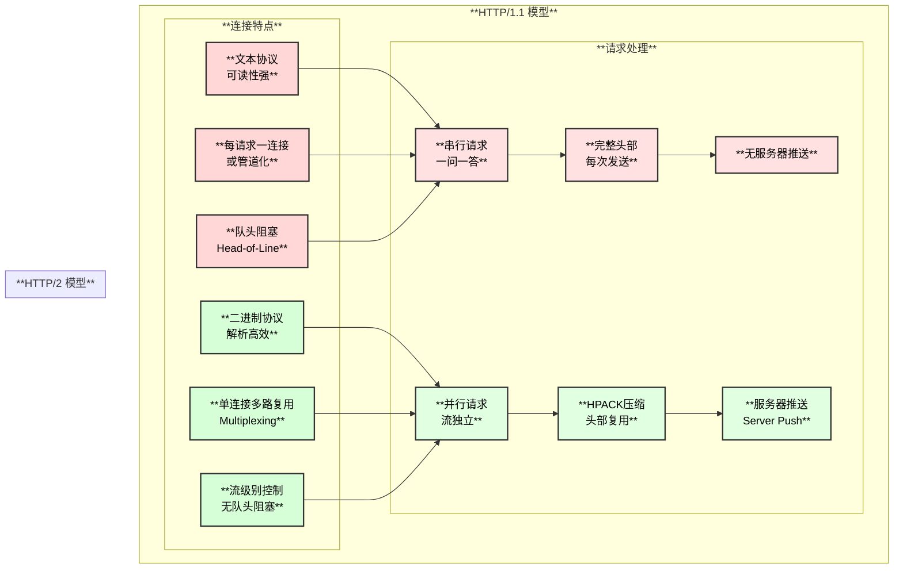

### 核心差异对比表

| **特性** | **HTTP/1.1** | **HTTP/2** |
|---------|--------------|------------|
| **协议格式** | 文本协议，可读性强 | 二进制帧协议，解析高效 |
| **多路复用** | 不支持，需多连接 | 支持，单连接多流 |
| **头部处理** | 每次完整发送，冗余大 | HPACK压缩，增量传输 |
| **队头阻塞** | 存在，影响后续请求 | 流级别独立，无阻塞 |
| **流控制** | TCP级别 | HTTP/2帧级别+TCP级别 |
| **服务器推送** | 不支持 | 支持 Server Push |
| **连接数** | 通常6-8个/域名 | 通常1个/域名 |

---

## HTTP 协议数据传输原理

### HTTP/2 帧结构

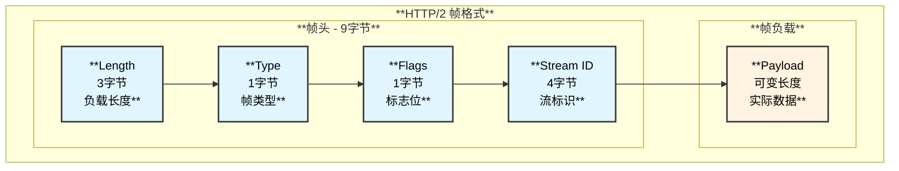

### HTTP/2 帧类型

| **帧类型** | **类型值** | **用途** |
|-----------|-----------|---------|
| DATA | 0x0 | 传输请求/响应体数据 |
| HEADERS | 0x1 | 传输HTTP头部 |
| PRIORITY | 0x2 | 流优先级（已弃用） |
| RST_STREAM | 0x3 | 终止流 |
| SETTINGS | 0x4 | 连接配置参数 |
| PUSH_PROMISE | 0x5 | 服务器推送承诺 |
| PING | 0x6 | 连接探活/延迟测量 |
| GOAWAY | 0x7 | 优雅关闭连接 |
| WINDOW_UPDATE | 0x8 | 流量控制窗口更新 |
| CONTINUATION | 0x9 | 头部延续帧 |

### 数据流 vs 控制流

HTTP/2 帧可以分为两大类：**数据流帧** 和 **控制流帧**。

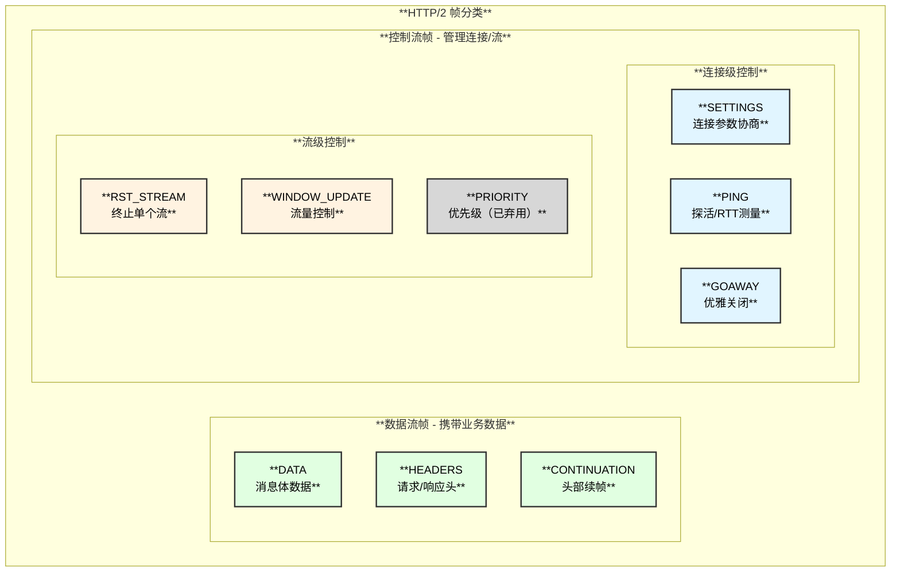

### 数据流与控制流交互时序

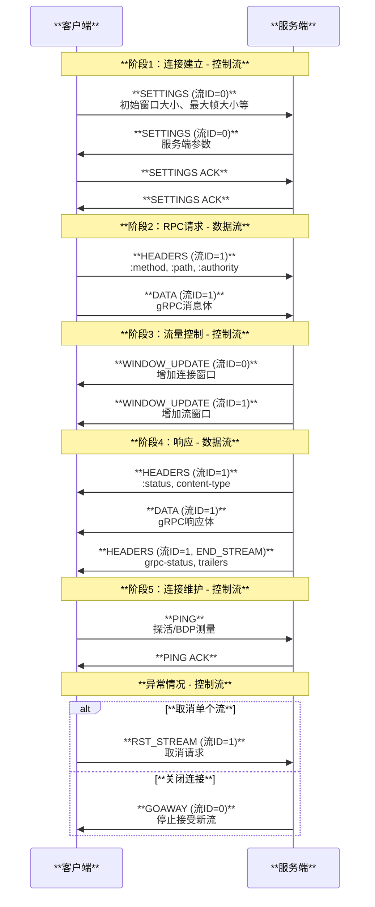

### gRPC 完整 RPC 帧序列

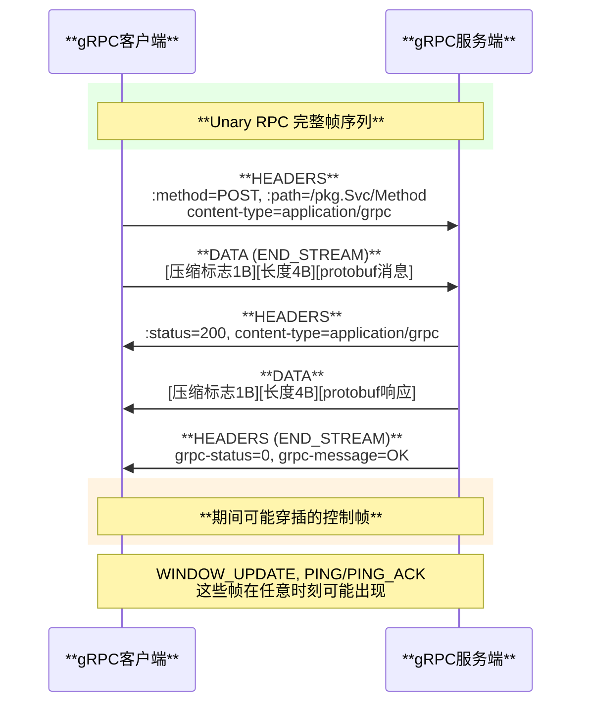

### gRPC 消息封装格式

```
┌─────────────────────────────────────────────────────┐
│                  gRPC 消息格式                       │
├─────────────┬─────────────────┬─────────────────────┤
│  压缩标志    │    长度前缀       │     Protobuf 数据   │
│  1 字节     │    4 字节         │     可变长度        │
│  (0/1)      │  (Big Endian)    │   (序列化后消息)     │
└─────────────┴─────────────────┴─────────────────────┘
```

---

## BDP 估算机制

### 什么是 BDP

**BDP (Bandwidth-Delay Product)** 是带宽延迟积，表示在任意时刻网络链路中"在途"数据的最大量。

**公式**: `BDP = 带宽(Bandwidth) × 往返延迟(RTT)`

### BDP 解决什么问题？

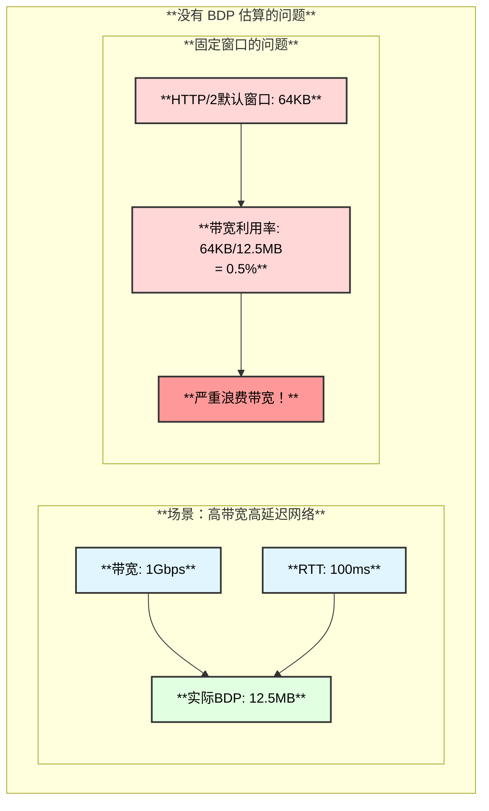

**BDP 估算的目的**：动态调整流控窗口大小，使其接近实际 BDP 值，从而**充分利用网络带宽**。

### 为什么需要动态估算？

| **问题** | **固定窗口** | **动态 BDP** |
|---------|------------|-------------|
| **窗口太小** | 带宽浪费，发送端频繁等待 | 根据网络自动放大 |
| **窗口太大** | 内存浪费，可能导致拥塞 | 保持合理上限 |
| **网络变化** | 无法适应 | 实时调整 |

### BDP 估算原理图解


### BDP 估算架构图

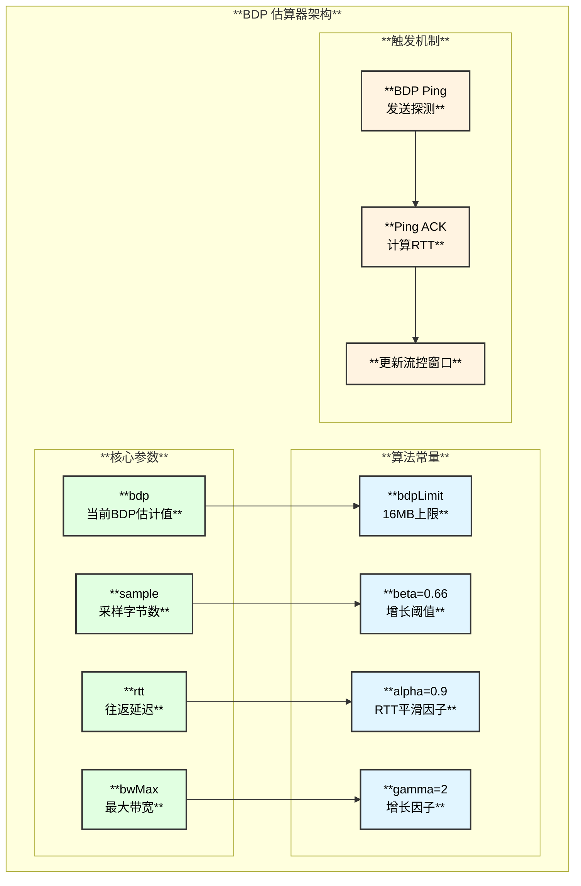

### BDP 估算时序图

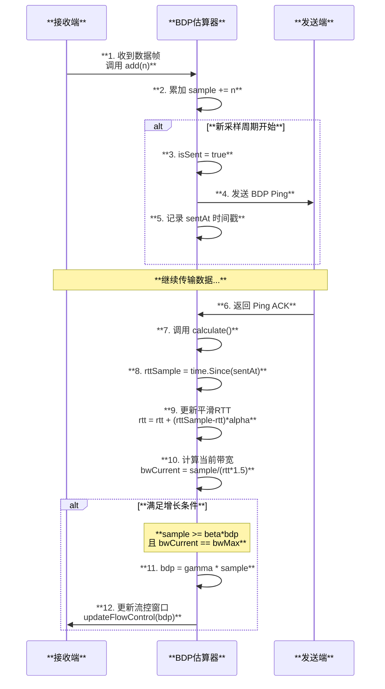

### BDP 估算函数调用链

```
handleData() - internal/transport/http2_client.go:1450
├── 接收数据帧
├── 调用 BDP 估算
│   └── bdpEstimator.add(n) - internal/transport/bdp_estimator.go:85
│       ├── 检查是否达到上限
│       │   └── if b.bdp == bdpLimit { return false }
│       ├── 新周期开始
│       │   ├── b.isSent = true
│       │   ├── b.sample = n
│       │   ├── b.sentAt = time.Time{}
│       │   └── b.sampleCount++
│       └── 累加采样
│           └── b.sample += n
│
├── 发送 BDP Ping（如果需要）
│   └── controlBuf.put(bdpPing) - internal/transport/controlbuf.go
│       └── bdpEstimator.timesnap() - internal/transport/bdp_estimator.go:74
│           └── b.sentAt = time.Now()
│
└── 收到 Ping ACK 时
    └── bdpEstimator.calculate() - internal/transport/bdp_estimator.go:105
        ├── 计算 RTT 样本
        │   └── rttSample = time.Since(b.sentAt).Seconds()
        ├── 更新平滑 RTT
        │   └── ┌────────────┬────────────────────────────────┐
        │       │  条件       │  计算公式                       │
        │       ├────────────┼────────────────────────────────┤
        │       │  前10个样本 │  rtt += (rttSample-rtt)/count   │
        │       ├────────────┼────────────────────────────────┤
        │       │  后续样本   │  rtt += (rttSample-rtt)*0.9    │
        │       └────────────┴────────────────────────────────┘
        ├── 计算当前带宽
        │   └── bwCurrent = sample / (rtt * 1.5)
        ├── 更新最大带宽
        │   └── if bwCurrent > b.bwMax { b.bwMax = bwCurrent }
        └── 判断是否需要增长 BDP
            └── if sample >= 0.66*bdp && bwCurrent == bwMax
                └── bdp = 2 * sample
                    └── updateFlowControl(bdp)
```

---

## 多路复用实现原理

### 多路复用架构图

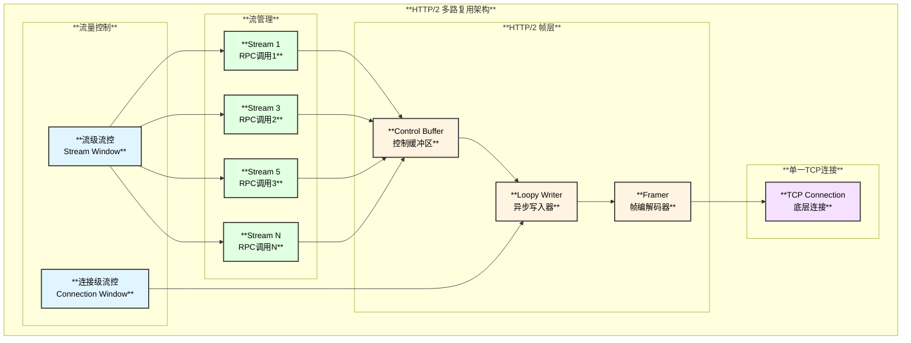

### 流管理数据结构

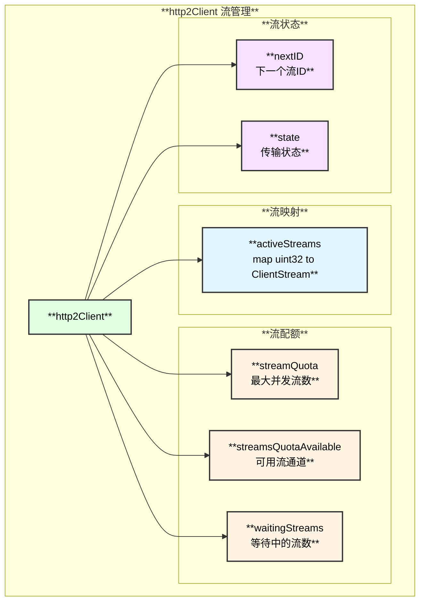

### 多路复用时序图

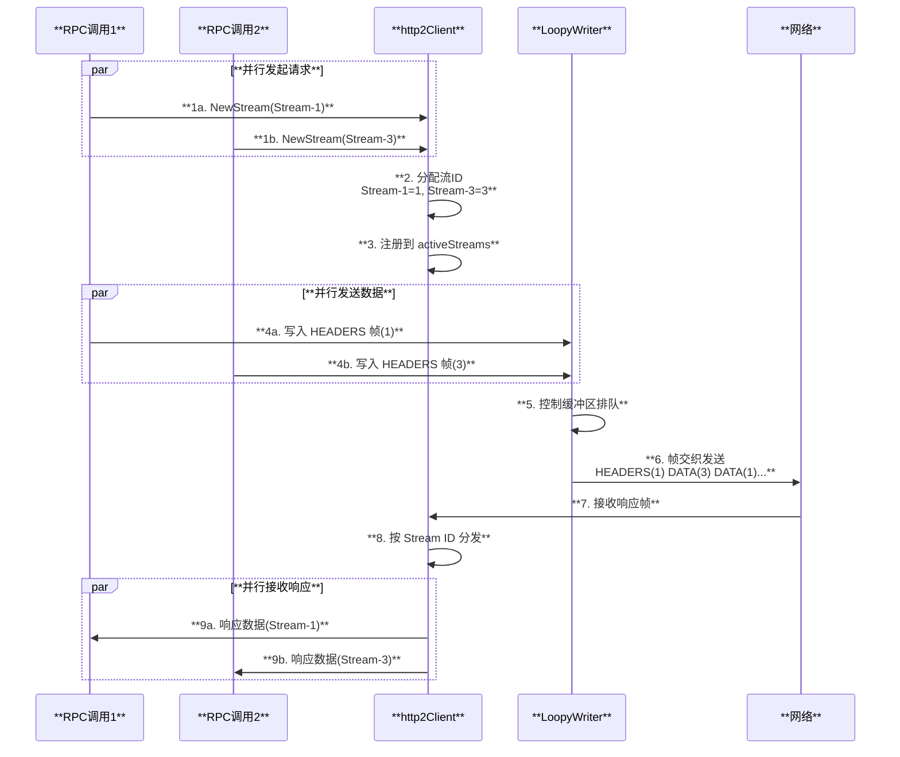

### 流量控制机制

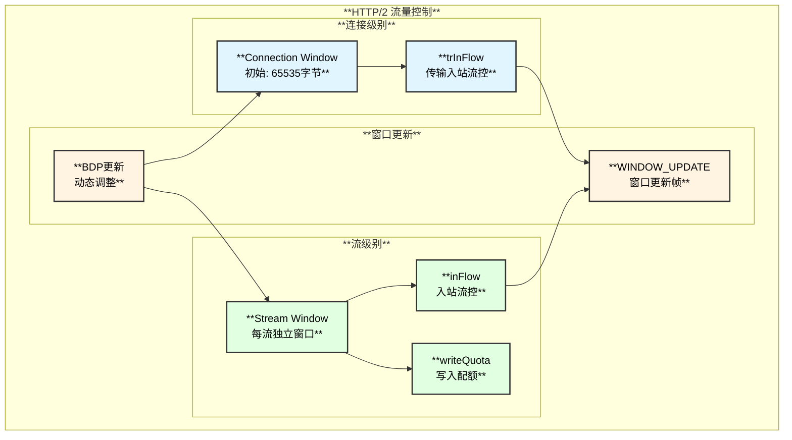

---

## 连接池管理机制

### 连接池架构图

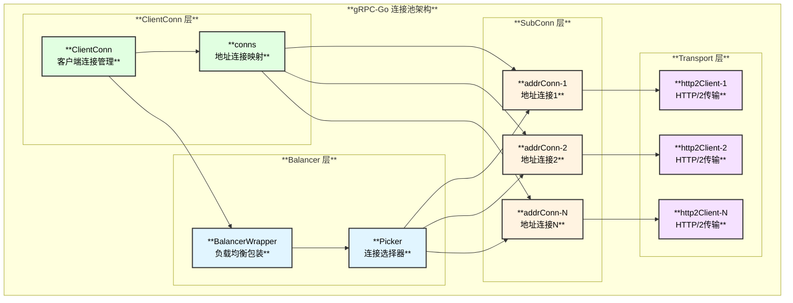

### addrConn 状态机

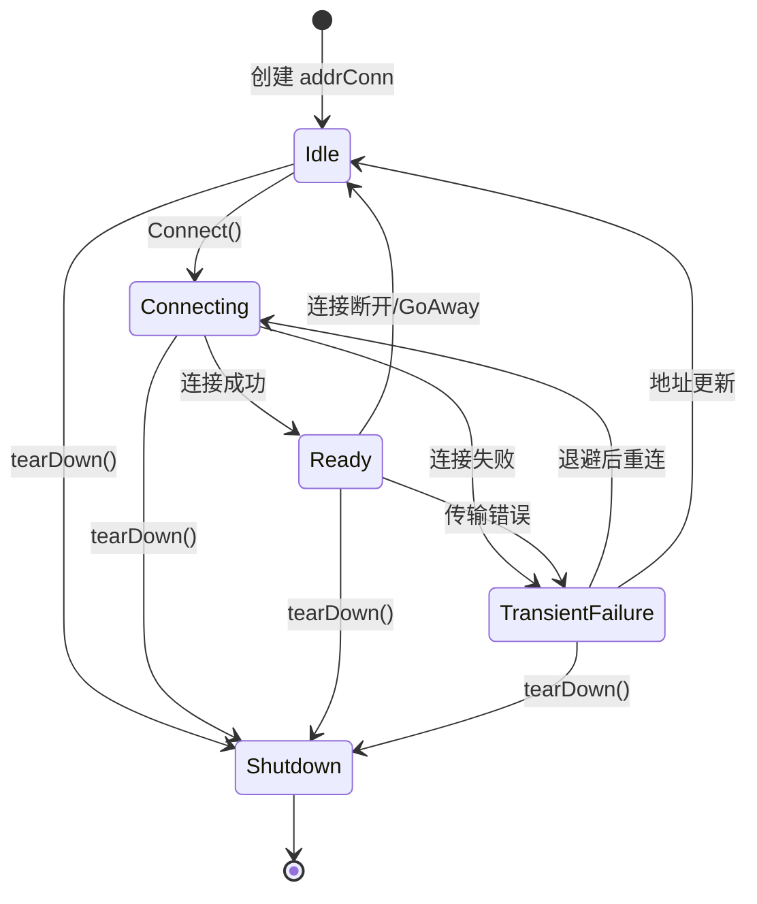

### 状态机详细说明

| **状态** | **含义** | **触发转换** |
|---------|--------|-------------|
| **Idle** | 空闲状态，未连接 | 初始状态或连接断开后 |
| **Connecting** | 正在建立连接 | 调用 `Connect()` |
| **Ready** | 连接就绪，可发送 RPC | 传输建立成功 |
| **TransientFailure** | 临时故障，将重试 | 连接/传输失败 |
| **Shutdown** | 已关闭，不可恢复 | 调用 `tearDown()` |

### 连接建立时序图

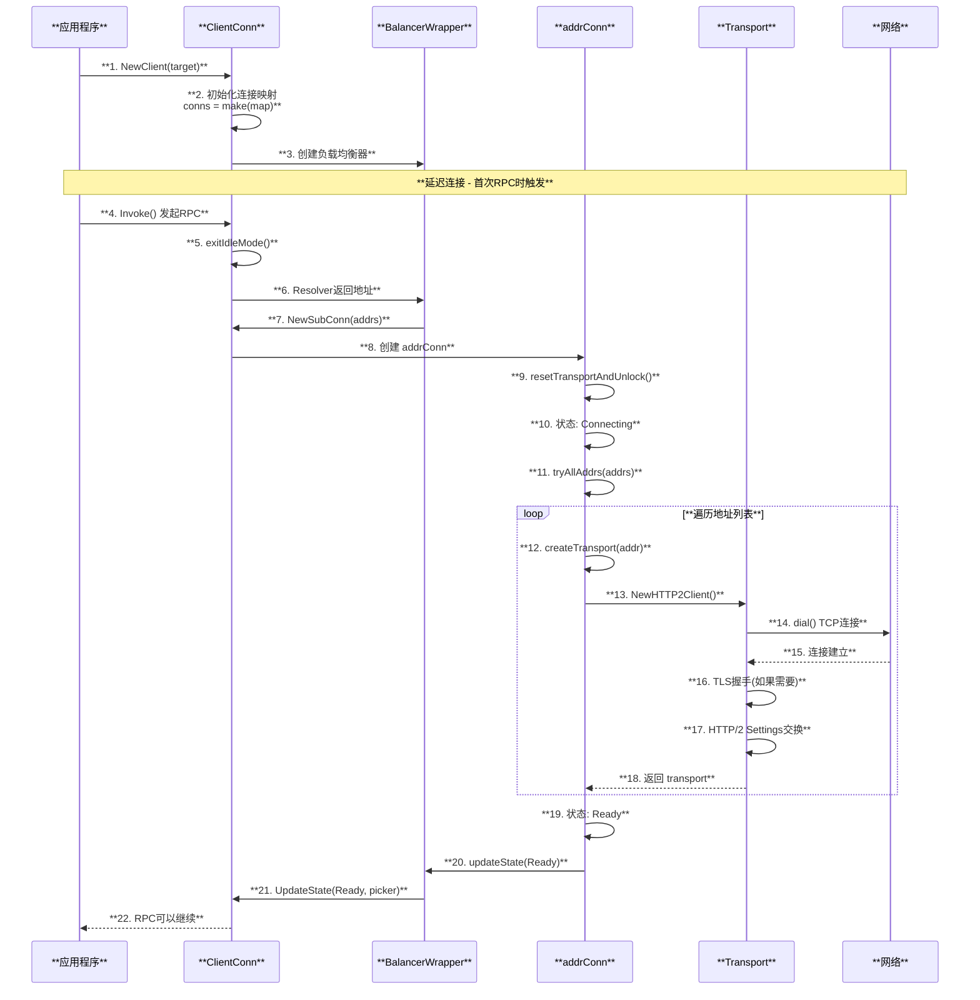

### 连接池管理函数调用链

```
NewClient() - clientconn.go:183
├── 初始化 ClientConn
│   └── cc.conns = make(map[*addrConn]struct{})
├── 创建解析器包装
│   └── newCCResolverWrapper() - resolver_wrapper.go
├── 创建负载均衡包装
│   └── newCCBalancerWrapper() - balancer_wrapper.go
└── 返回 ClientConn

exitIdleMode() - clientconn.go:665
├── 启动解析器
│   └── cc.resolverWrapper.start()
└── 等待首次解析完成

Resolver 返回地址后
└── updateResolverStateAndUnlock() - clientconn.go:770
    └── cc.balancerWrapper.updateClientConnState()
        └── Balancer.UpdateClientConnState()
            └── ccBalancerWrapper.NewSubConn() - balancer_wrapper.go:226
                └── cc.newAddrConnLocked() - clientconn.go:1088
                    ├── 创建 addrConn 结构
                    │   └── ┌────────────────┬────────────────────────────────┐
                    │       │  字段           │  说明                          │
                    │       ├────────────────┼────────────────────────────────┤
                    │       │  ctx, cancel   │  生命周期控制                   │
                    │       ├────────────────┼────────────────────────────────┤
                    │       │  cc            │  父 ClientConn 引用            │
                    │       ├────────────────┼────────────────────────────────┤
                    │       │  addrs         │  解析后的地址列表               │
                    │       ├────────────────┼────────────────────────────────┤
                    │       │  transport     │  当前活跃的 HTTP/2 传输         │
                    │       ├────────────────┼────────────────────────────────┤
                    │       │  state         │  连接状态(Idle/Ready等)         │
                    │       ├────────────────┼────────────────────────────────┤
                    │       │  backoffIdx    │  退避重连索引                   │
                    │       └────────────────┴────────────────────────────────┘
                    └── 注册到 cc.conns 映射

addrConn.connect() - clientconn.go:xxx
└── go ac.resetTransportAndUnlock() - clientconn.go:1319
    ├── 设置状态为 Connecting
    │   └── ac.updateConnectivityState(connectivity.Connecting, nil)
    ├── 计算连接超时和退避时间
    │   └── backoffFor = ac.dopts.bs.Backoff(ac.backoffIdx)
    └── 尝试所有地址
        └── ac.tryAllAddrs() - clientconn.go:1445
            └── for addr := range addrs
                └── ac.createTransport() - clientconn.go:1483
                    ├── 创建 HTTP/2 客户端
                    │   └── transport.NewHTTP2Client() - internal/transport/http2_client.go:207
                    │       ├── dial() 建立 TCP 连接
                    │       ├── TLS 握手 (可选)
                    │       ├── HTTP/2 Settings 帧交换
                    │       ├── 初始化 BDP 估算器
                    │       ├── 启动 reader goroutine
                    │       └── 启动 keepalive goroutine
                    ├── 设置当前地址和传输
                    │   └── ac.curAddr = addr
                    │       ac.transport = newTr
                    └── 启动健康检查
                        └── ac.startHealthCheck()
```

### 连接生命周期管理

| **阶段** | **操作** | **相关方法** |
|---------|---------|-------------|
| **创建** | 通过 Balancer 请求创建 | `NewSubConn()` → `newAddrConnLocked()` |
| **连接** | 延迟连接或显式调用 | `connect()` → `resetTransportAndUnlock()` |
| **就绪** | 传输建立成功 | `createTransport()` → 状态变为 Ready |
| **使用** | RPC 通过 Picker 选择 | `Pick()` → 获取 SubConn |
| **断开** | 连接丢失或 GoAway | `onClose()` → 状态变为 Idle |
| **重连** | 退避后自动重连 | `resetTransportAndUnlock()` |
| **关闭** | ClientConn 关闭 | `tearDown()` → 状态变为 Shutdown |

---

## 总结

gRPC-Go 的 HTTP/2 传输层实现了以下关键特性：

1. **高效的多路复用**: 单连接上支持大量并发 RPC，通过流 ID 隔离请求
2. **智能的流量控制**: 结合 BDP 估算动态调整窗口大小
3. **灵活的连接管理**: 延迟连接、自动重连、负载均衡集成
4. **完善的生命周期管理**: 从创建到关闭的完整状态机

这些机制共同确保了 gRPC 在各种网络条件下的高性能和可靠性。

