# gRPC-Go 内存优化深度解析

## 目录
1. [内存优化概述](#内存优化概述)
2. [缓冲池架构](#缓冲池架构)
3. [Buffer 引用计数机制](#buffer-引用计数机制)
4. [BufferSlice 零拷贝设计](#bufferslice-零拷贝设计)
5. [时序流程](#时序流程)
6. [函数调用链](#函数调用链)

---

## 内存优化概述

### 为什么需要内存优化？

在高并发 RPC 场景中，内存管理是关键性能瓶颈：

1. **频繁分配释放**: 每个请求都需要分配缓冲区
2. **GC 压力**: 大量临时对象增加 GC 负担
3. **内存碎片**: 不同大小的分配导致碎片化
4. **数据拷贝**: 多层处理导致重复拷贝

### gRPC-Go 的内存优化策略

| **策略** | **实现** | **效果** |
|---------|---------|---------|
| **缓冲池** | TieredBufferPool | 减少分配，复用内存 |
| **引用计数** | Buffer.Ref/Free | 安全共享，延迟释放 |
| **分层池化** | 多级大小池 | 减少碎片，提高命中率 |
| **零拷贝** | BufferSlice | 避免数据复制 |

---

## 缓冲池架构

### 池到底存储了什么？

**核心问题**：池中存储的是什么？一堆字节块？还是一段连续字节段？

**答案**：池中存储的是 **`*[]byte` 指针**，每个指针指向一个独立的字节切片（byte slice）。

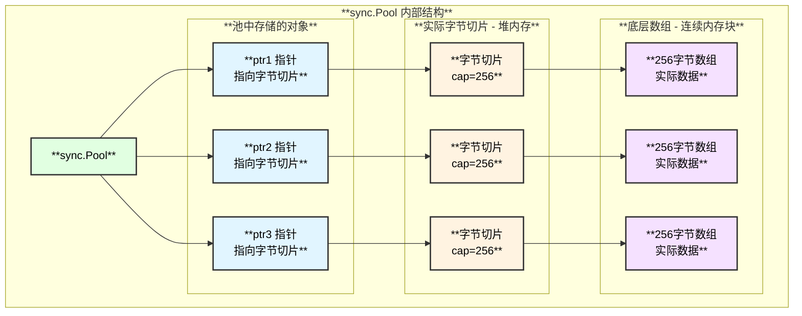

### 为什么存储 `*[]byte` 而非 `[]byte`？

| **对比** | **存储 `[]byte`** | **存储 `*[]byte`** |
|---------|------------------|-------------------|
| **接口类型转换** | 每次 Get/Put 需要 `interface{}` 装箱，分配内存 | 指针是引用类型，装箱不分配 |
| **切片修改** | 取出后修改长度，原池中不受影响 | 可直接修改指针指向的切片 |
| **内存效率** | 较低 | 较高 |

### 整体架构图

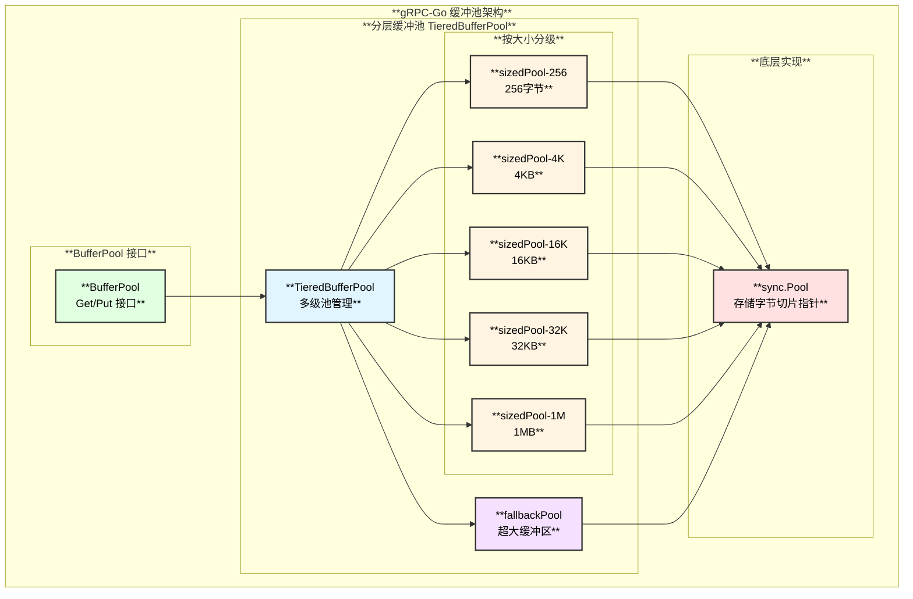

### 默认池大小配置

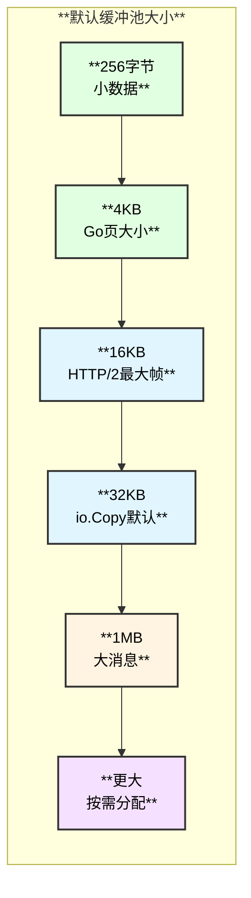

### 池选择算法

```go
// 二分查找合适的池
func (p *tieredBufferPool) getPool(size int) BufferPool {
    poolIdx := sort.Search(len(p.sizedPools), func(i int) bool {
        return p.sizedPools[i].defaultSize >= size
    })
    
    if poolIdx == len(p.sizedPools) {
        return &p.fallbackPool  // 超大缓冲区使用回退池
    }
    
    return p.sizedPools[poolIdx]
}
```

| **请求大小** | **选择的池** | **实际分配** |
|------------|-------------|-------------|
| 100 字节 | sizedPool-256 | 256 字节 |
| 1000 字节 | sizedPool-4K | 4096 字节 |
| 10000 字节 | sizedPool-16K | 16384 字节 |
| 20000 字节 | sizedPool-32K | 32768 字节 |
| 500000 字节 | sizedPool-1M | 1048576 字节 |
| 2000000 字节 | fallbackPool | 按需分配 |

---

## Buffer 引用计数机制

### 什么是数据视图（Data View）？

**数据视图**是指多个 `buffer` 结构体可以**共享同一块底层内存**，但各自持有不同的"窗口"（子切片）来访问数据。

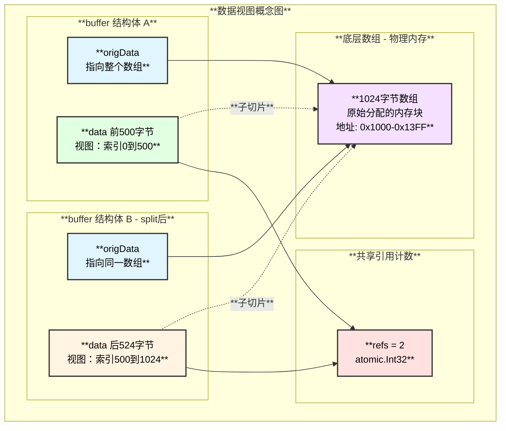

### 引用计数对什么进行计数？

**引用计数**针对的是 **共享同一块底层内存的 buffer 结构体数量**。

| **操作** | **引用计数变化** | **说明** |
|---------|----------------|---------|
| `NewBuffer()` | refs = 1 | 创建新 buffer |
| `Ref()` | refs++ | 显式增加引用（共享给其他协程） |
| `split(n)` | refs++ | 分割产生新的 buffer，共享底层数组 |
| `Free()` | refs-- | 释放引用 |
| refs == 0 | 归还池 | 最后一个引用释放时，底层内存归还池 |

### Buffer 类型层次

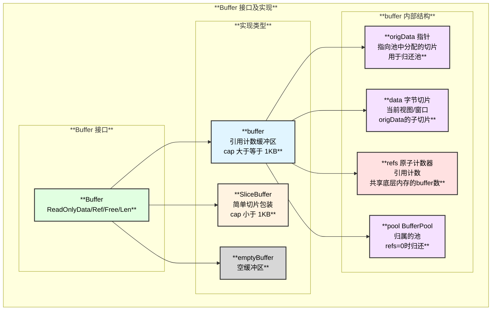

### 完整结构关系图

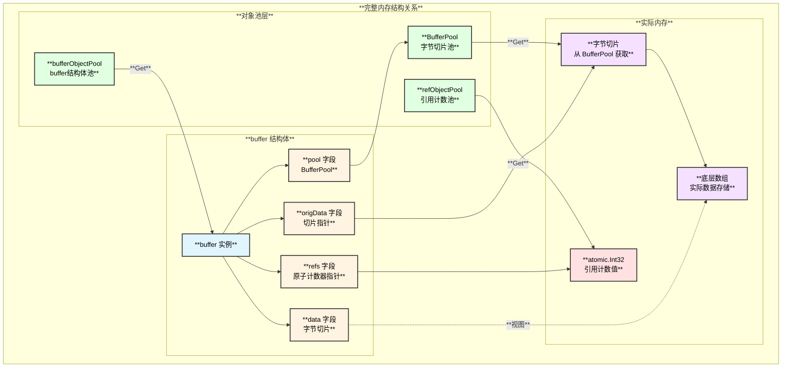

### 引用计数生命周期

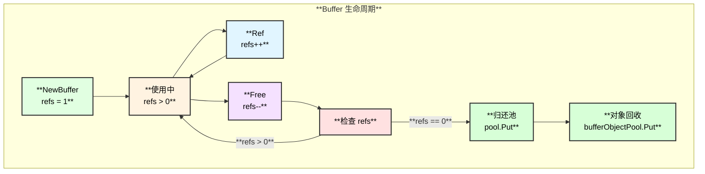

### 生命周期管理详细时序

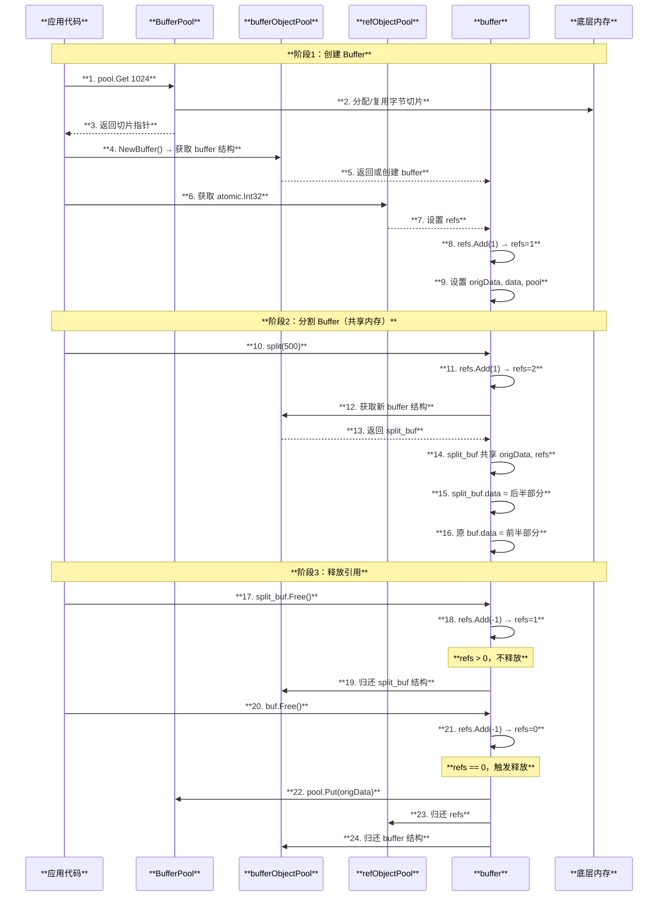

### 池化阈值判断

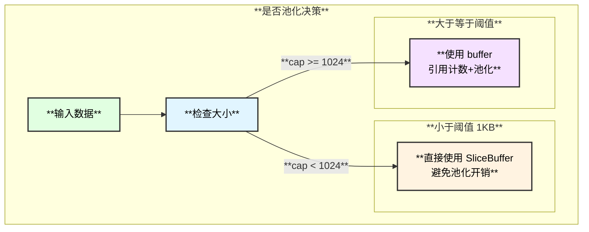

---

## BufferSlice 零拷贝设计

### BufferSlice 架构

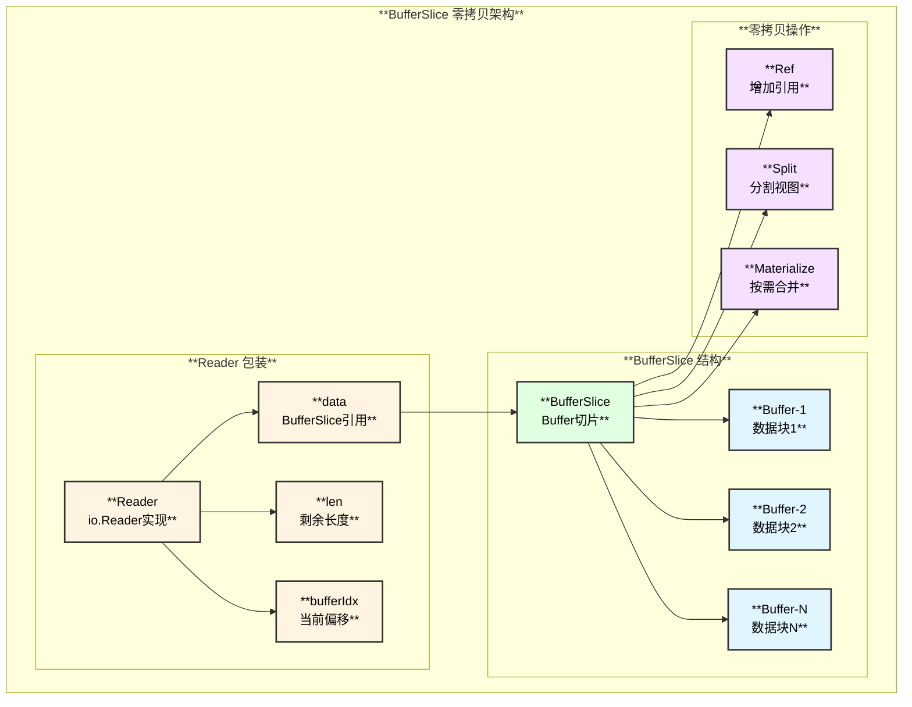

### 零拷贝读取流程

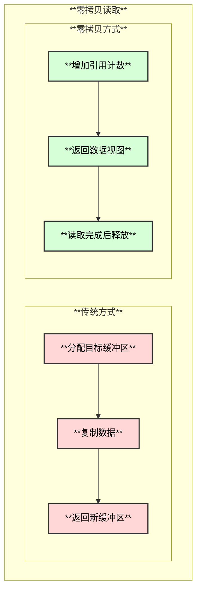

### MaterializeToBuffer 优化

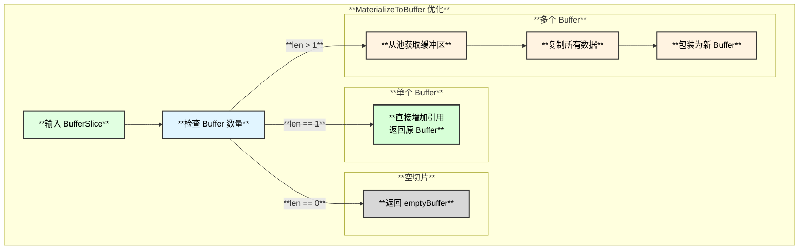

---

## 时序流程

### 缓冲区获取与释放

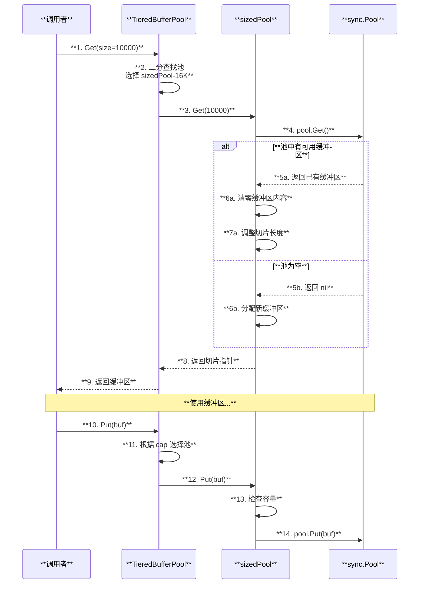

### Buffer 引用计数操作

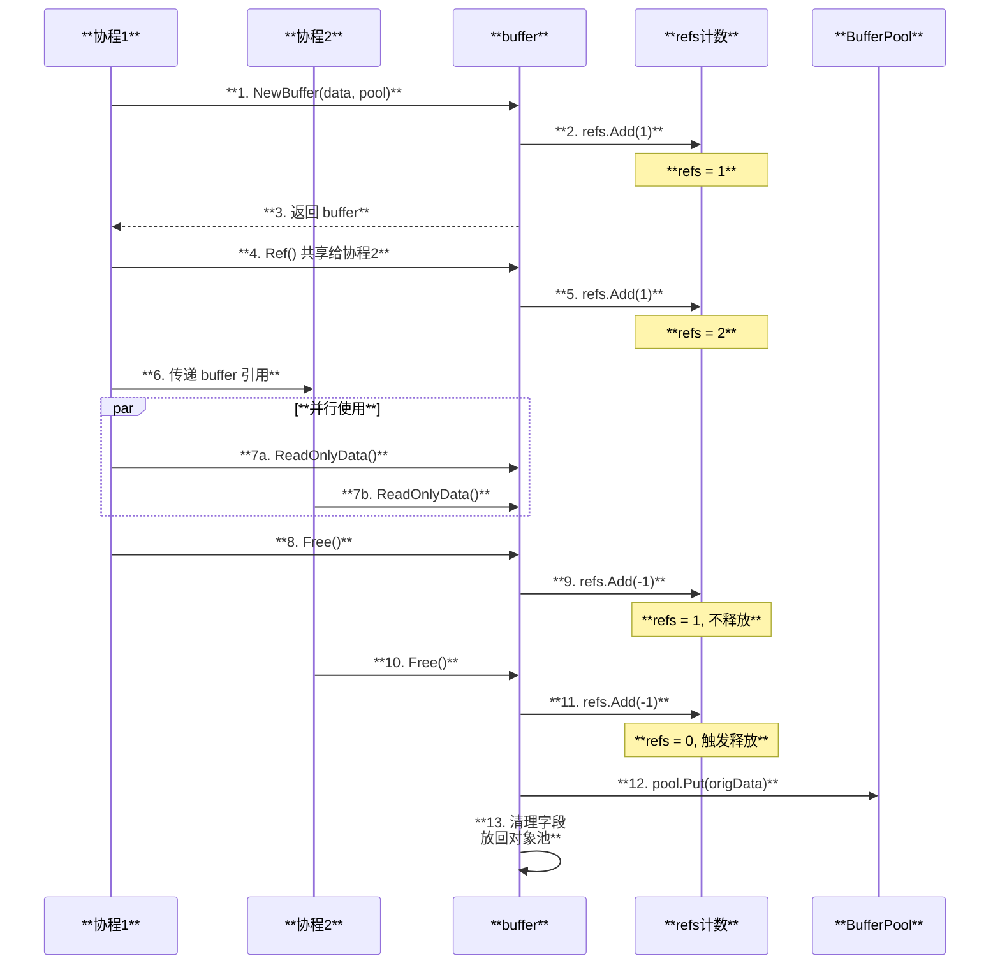

### BufferSlice 读取流程

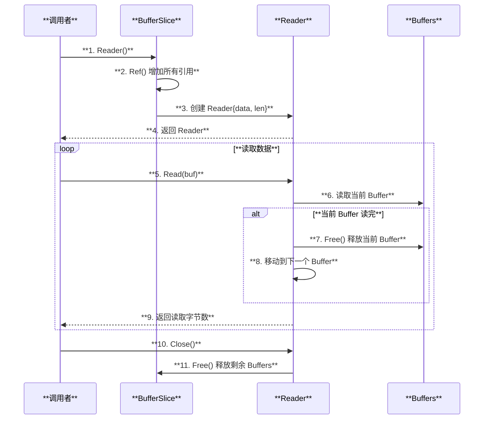

---

## 函数调用链

### 缓冲池获取调用链

```
BufferPool.Get(length) - mem/buffer_pool.go
│
├── tieredBufferPool.Get() - mem/buffer_pool.go:92
│   ├── 选择合适的池
│   │   └── p.getPool(size) - mem/buffer_pool.go:100
│   │       └── sort.Search() 二分查找
│   │           └── ┌────────────────┬────────────────────────────────┐
│   │               │  池索引         │  大小范围                       │
│   │               ├────────────────┼────────────────────────────────┤
│   │               │  0             │  <= 256 字节                    │
│   │               ├────────────────┼────────────────────────────────┤
│   │               │  1             │  257 - 4096 字节               │
│   │               ├────────────────┼────────────────────────────────┤
│   │               │  2             │  4097 - 16384 字节             │
│   │               ├────────────────┼────────────────────────────────┤
│   │               │  3             │  16385 - 32768 字节            │
│   │               ├────────────────┼────────────────────────────────┤
│   │               │  4             │  32769 - 1048576 字节          │
│   │               ├────────────────┼────────────────────────────────┤
│   │               │  fallback      │  > 1048576 字节                │
│   │               └────────────────┴────────────────────────────────┘
│   │
│   └── 从选定池获取
│       └── sizedBufferPool.Get() - mem/buffer_pool.go:125
│           ├── 从 sync.Pool 获取
│           │   └── p.pool.Get().(*[]byte)
│           ├── 如果获取到
│           │   ├── clear(buf[:cap])  // 清零
│           │   └── *buf = buf[:size]  // 调整长度
│           └── 如果池为空
│               └── buf := make([]byte, size, p.defaultSize)
│
└── simpleBufferPool.Get() (fallback) - mem/buffer_pool.go:163
    ├── 尝试从池获取
    │   └── p.pool.Get().(*[]byte)
    ├── 如果容量足够
    │   └── 调整长度返回
    └── 如果容量不足
        ├── 放回池中
        │   └── p.pool.Put(bs)
        └── 分配新缓冲区（向上取整到页大小）
            └── allocSize = (size + 4095) & ^4095
                b := make([]byte, size, allocSize)
```

### Buffer 创建调用链

```
NewBuffer(data *[]byte, pool BufferPool) - mem/buffers.go:94
├── 检查是否需要池化
│   └── if pool == nil || IsBelowBufferPoolingThreshold(cap(*data))
│       └── return SliceBuffer(*data)  // 小缓冲区不池化
│           └── ┌────────────────┬────────────────────────────────┐
│               │  阈值           │  bufferPoolingThreshold = 1024 │
│               ├────────────────┼────────────────────────────────┤
│               │  原因           │  小对象池化开销大于收益          │
│               └────────────────┴────────────────────────────────┘
│
├── 从对象池获取 buffer 结构
│   └── b := newBuffer() - mem/buffers.go:82
│       └── bufferObjectPool.Get().(*buffer)
│
├── 设置字段
│   └── b.origData = data
│       b.data = *data
│       b.pool = pool
│
├── 初始化引用计数
│   └── b.refs = refObjectPool.Get().(*atomic.Int32)
│       b.refs.Add(1)
│
└── 返回 buffer
```

### Buffer.Free 调用链

```
buffer.Free() - mem/buffers.go:143
├── 检查是否已释放
│   └── if b.refs == nil { panic("Cannot free freed buffer") }
│
├── 减少引用计数
│   └── refs := b.refs.Add(-1)
│
└── 根据引用计数决定操作
    └── switch {
        case refs > 0:
            └── return  // 还有其他引用，不释放
        
        case refs == 0:
            ├── 归还数据到缓冲池
            │   └── if b.pool != nil {
            │           b.pool.Put(b.origData)
            │       }
            ├── 归还引用计数对象
            │   └── refObjectPool.Put(b.refs)
            ├── 清理字段
            │   └── b.origData = nil
            │       b.data = nil
            │       b.refs = nil
            │       b.pool = nil
            └── 归还 buffer 对象
                └── bufferObjectPool.Put(b)
        
        default:
            └── panic("Cannot free freed buffer")  // refs < 0，重复释放
    }
```

### BufferSlice.Reader 调用链

```
BufferSlice.Reader() - mem/buffer_slice.go:121
├── 增加所有 Buffer 的引用
│   └── s.Ref() - mem/buffer_slice.go:62
│       └── for _, b := range s { b.Ref() }
│
└── 创建 Reader
    └── return &Reader{
            data: s,
            len:  s.Len(),
        }

Reader.Read(buf []byte) - mem/buffer_slice.go:178
├── 检查是否有数据
│   └── if r.len == 0 { return 0, io.EOF }
│
└── 循环读取
    └── for len(buf) != 0 && r.len != 0 {
        ├── 获取当前 Buffer 数据
        │   └── data := r.data[0].ReadOnlyData()
        │
        ├── 复制数据
        │   └── copied := copy(buf, data[r.bufferIdx:])
        │
        ├── 更新状态
        │   └── r.len -= copied
        │       r.bufferIdx += copied
        │       n += copied
        │       buf = buf[copied:]
        │
        └── 释放已读完的 Buffer
            └── r.freeFirstBufferIfEmpty() - mem/buffer_slice.go:167
                └── if r.bufferIdx == len(r.data[0].ReadOnlyData()) {
                        r.data[0].Free()
                        r.data = r.data[1:]
                        r.bufferIdx = 0
                    }
    }
```

### gRPC 消息处理中的缓冲池使用

```
recv() 接收消息 - stream.go
├── 读取消息长度前缀
│   └── recvBuffer.get()
│
├── 从池获取缓冲区
│   └── buf := pool.Get(msgLen)
│
├── 读取消息体
│   └── io.ReadFull(reader, *buf)
│
├── 解压缩（如果需要）
│   └── decompress(buf)
│
├── 反序列化
│   └── proto.Unmarshal(*buf, msg)
│
└── 释放缓冲区
    └── buf.Free()  // 或延迟释放

send() 发送消息 - stream.go
├── 序列化消息
│   └── data := encode(codec, msg)
│       └── ┌────────────────┬────────────────────────────────┐
│           │  步骤           │  说明                          │
│           ├────────────────┼────────────────────────────────┤
│           │  获取缓冲区     │  pool.Get(estimatedSize)       │
│           ├────────────────┼────────────────────────────────┤
│           │  序列化        │  proto.Marshal(msg) 到缓冲区    │
│           ├────────────────┼────────────────────────────────┤
│           │  包装为Buffer  │  NewBuffer(buf, pool)          │
│           └────────────────┴────────────────────────────────┘
│
├── 压缩（如果需要）
│   └── compData := compress(data)
│
├── 构造消息头
│   └── msgHeader(data, compData, pf)
│
├── 写入传输层
│   └── stream.Write(hdr, payload)
│
└── 释放缓冲区
    └── data.Free()
        compData.Free()
```

---

## 性能优化效果

### 内存分配对比

| **场景** | **无缓冲池** | **有缓冲池** |
|---------|------------|-------------|
| **10000 RPC/s** | ~10000 alloc/s | ~100 alloc/s |
| **内存峰值** | 高，波动大 | 低，稳定 |
| **GC 频率** | 高 | 低 |
| **P99 延迟** | 较高 | 较低 |

### 零拷贝效果

| **操作** | **传统方式** | **零拷贝方式** |
|---------|------------|--------------|
| **BufferSlice.Reader** | 复制整个切片 | 仅增加引用 |
| **MaterializeToBuffer(1个)** | 复制数据 | 仅增加引用 |
| **Split** | 复制两份 | 共享底层数据 |

### 最佳实践

```go
// 1. 使用 BufferPool 而非直接分配
buf := pool.Get(size)
defer pool.Put(buf)

// 2. 正确管理 Buffer 引用
buffer := mem.NewBuffer(data, pool)
buffer.Ref()  // 共享前增加引用
// 传递给其他协程
buffer.Free()  // 使用完毕后释放

// 3. 使用 BufferSlice 避免合并
slice := mem.BufferSlice{buf1, buf2, buf3}
reader := slice.Reader()  // 零拷贝读取
defer reader.Close()
```

---

## 总结

gRPC-Go 的内存优化系统通过以下机制实现高效内存管理：

1. **分层缓冲池**: 按大小分级，减少碎片，提高命中率
2. **引用计数**: 安全共享缓冲区，延迟释放
3. **池化阈值**: 小对象直接分配，避免池化开销
4. **零拷贝设计**: BufferSlice 避免不必要的数据复制

这些优化在高并发场景下显著减少内存分配、降低 GC 压力、提升性能稳定性。

