# gRPC-Go 服务端工作池实现解析

## 目录
1. [工作池概述](#工作池概述)
2. [架构设计](#架构设计)
3. [实现原理](#实现原理)
4. [时序流程](#时序流程)
5. [函数调用链](#函数调用链)
6. [性能优化原理](#性能优化原理)

---

## 工作池概述

### 为什么需要工作池？

在 Go 语言中，每个 goroutine 都有自己的栈空间。当栈空间不足时，Go 运行时会调用 `runtime.morestack` 来扩展栈空间，这个操作涉及：

1. **栈复制**: 分配新栈空间并复制旧栈内容
2. **指针调整**: 更新所有栈上的指针
3. **性能开销**: 在高并发场景下可能成为瓶颈

工作池通过**复用 goroutine** 来避免频繁的栈分配和扩展，显著提升性能。

### 核心配置

| **配置项** | **默认值** | **说明** |
|-----------|-----------|---------|
| `numServerWorkers` | 0 (禁用) | 工作池中 worker 数量 |
| `serverWorkerResetThreshold` | 65536 (2^16) | Worker 重置阈值 |
| `maxConcurrentStreams` | MaxUint32 | 最大并发流数 |

---

## 架构设计

### 工作池整体架构

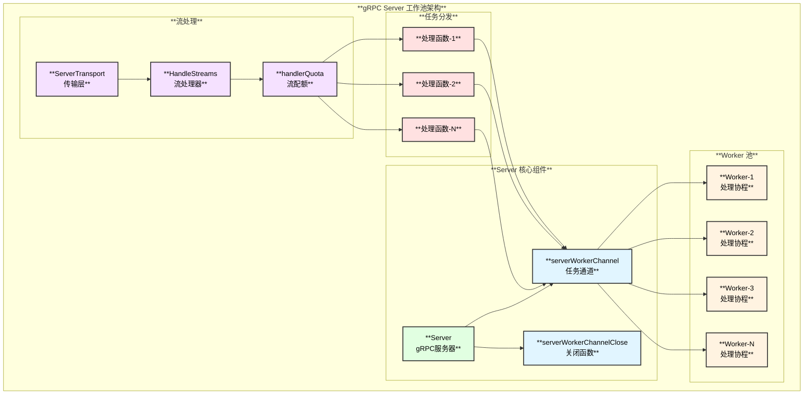

### Server 结构中的工作池字段

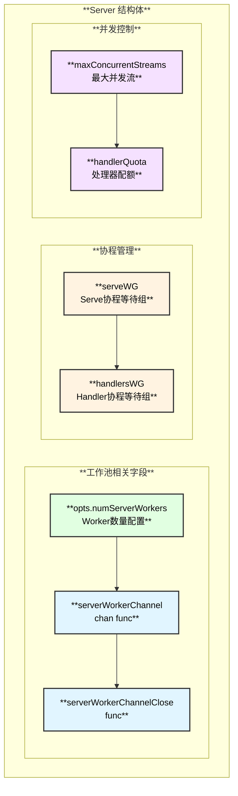

---

## 实现原理

### Worker 生命周期

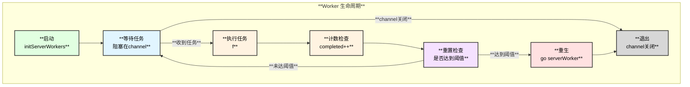

### Worker 重置机制

Worker 重置是为了解决 **goroutine 栈无法收缩** 的问题。

#### 问题根源：Go 栈管理机制

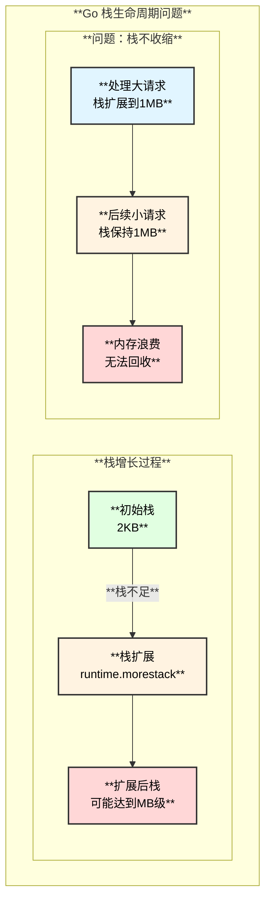

#### Go 运行时源码层面分析

**Go 的栈管理特点**（参考 `runtime/stack.go`）：

1. **栈增长机制**：当函数调用时栈空间不足，触发 `runtime.morestack`
2. **栈复制策略**：分配更大的栈（通常2倍），复制旧栈内容，更新所有指针
3. **栈不收缩**：Go 运行时**不会主动收缩** goroutine 的栈空间

```go
// Go runtime 伪代码 - runtime/stack.go
func newstack() {
    // 当前栈不足时调用
    oldsize := gp.stack.hi - gp.stack.lo
    newsize := oldsize * 2  // 通常翻倍
    
    // 分配新栈
    new := stackalloc(newsize)
    
    // 复制旧栈到新栈
    memmove(new, old, oldsize)
    
    // 调整栈上的指针（开销大！）
    adjustpointers(...)
}
```

#### Linux 内核层面分析

**虚拟内存与物理内存**：

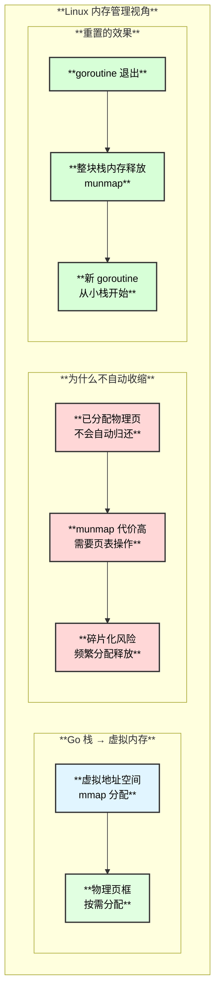

**Linux 层面的内存释放**：

| **阶段** | **Linux 操作** | **说明** |
|---------|---------------|---------|
| goroutine 创建 | `mmap(PROT_READ\|PROT_WRITE)` | 分配虚拟内存区域 |
| 栈使用 | Page Fault → 分配物理页 | 按需分配物理内存 |
| 栈扩展 | `mmap` 更大区域 + `munmap` 旧区域 | 重新映射 |
| goroutine 退出 | `munmap` | 释放虚拟地址空间，物理页归还 |

#### 源码实现详解

```go
// server.go:649-671
// serverWorkerResetThreshold = 1 << 16 = 65536
// 
// 为什么是 65536？
// - 假设 QPS = 5000，每个 Worker 约 13 秒重置一次
// - 既不会太频繁（创建 goroutine 有开销）
// - 也不会让大栈存在太久（内存浪费）

func (s *Server) serverWorker() {
    for completed := 0; completed < serverWorkerResetThreshold; completed++ {
        f, ok := <-s.serverWorkerChannel
        if !ok {
            return  // channel 关闭，Worker 退出
        }
        f()  // 执行任务，可能导致栈扩展
    }
    // 关键：启动新 Worker，当前 Worker 退出
    // - 当前 goroutine 的大栈被 GC 回收
    // - 新 goroutine 从 2KB 小栈开始
    go s.serverWorker()
}
```

#### 重置机制的效果图

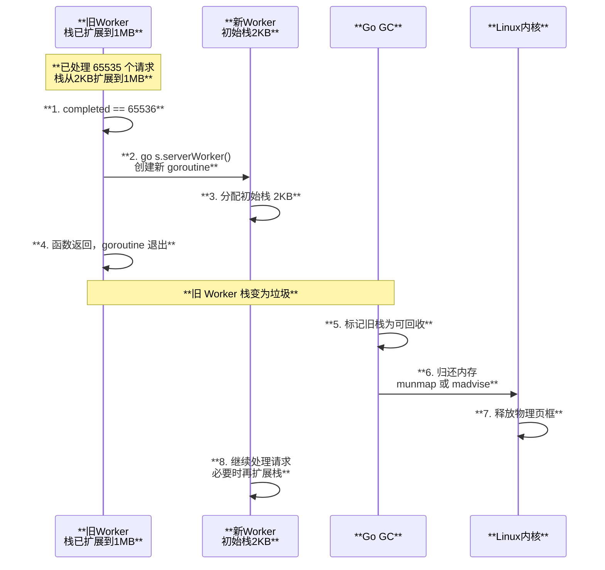

#### 为什么 Go 不自动收缩栈？

| **原因** | **说明** |
|---------|---------|
| **指针调整成本高** | 收缩栈需要扫描并调整所有栈指针，开销大 |
| **收缩时机难确定** | 何时收缩？收缩到多大？难以预测 |
| **可能很快又扩展** | 收缩后立即又需要扩展，浪费更多 |
| **设计哲学** | Go 选择简单的"只增不减"策略 |

#### 相关 Go Issue

源码注释引用的 Issue：[golang/go#18138](https://github.com/golang/go/issues/18138)

该 Issue 讨论了 `runtime.morestack` 在高并发场景下的性能问题，gRPC 的 Worker Pool 正是为了缓解这个问题。

### 任务分发策略

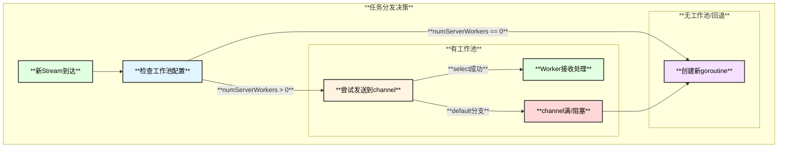

---

## 时序流程

### 服务器启动与工作池初始化

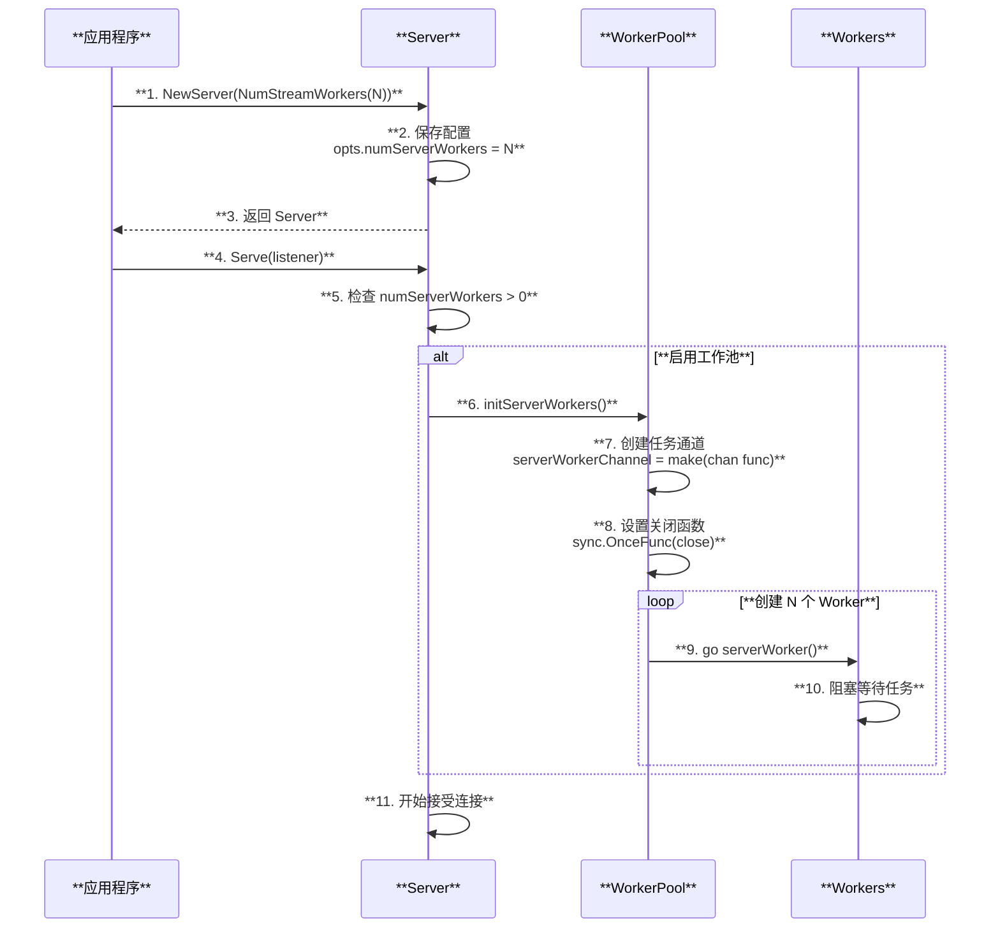

### 请求处理流程

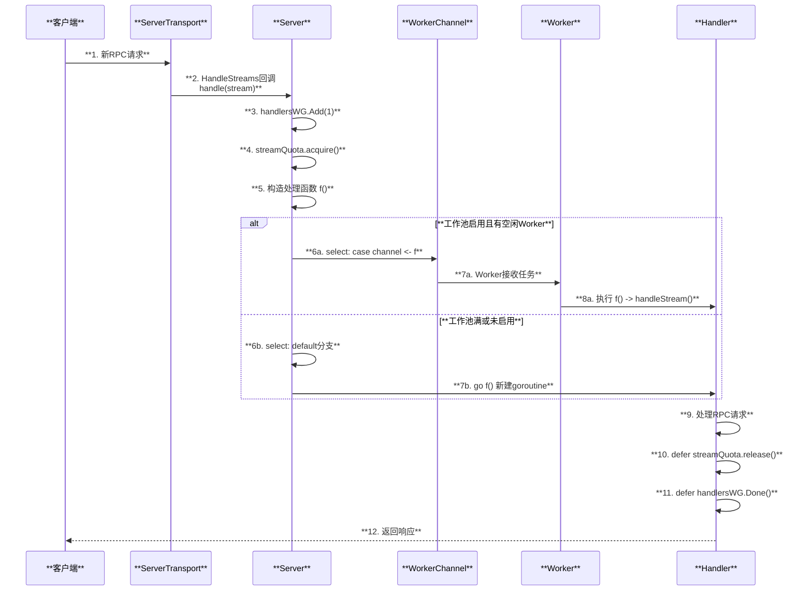

### 服务器关闭流程

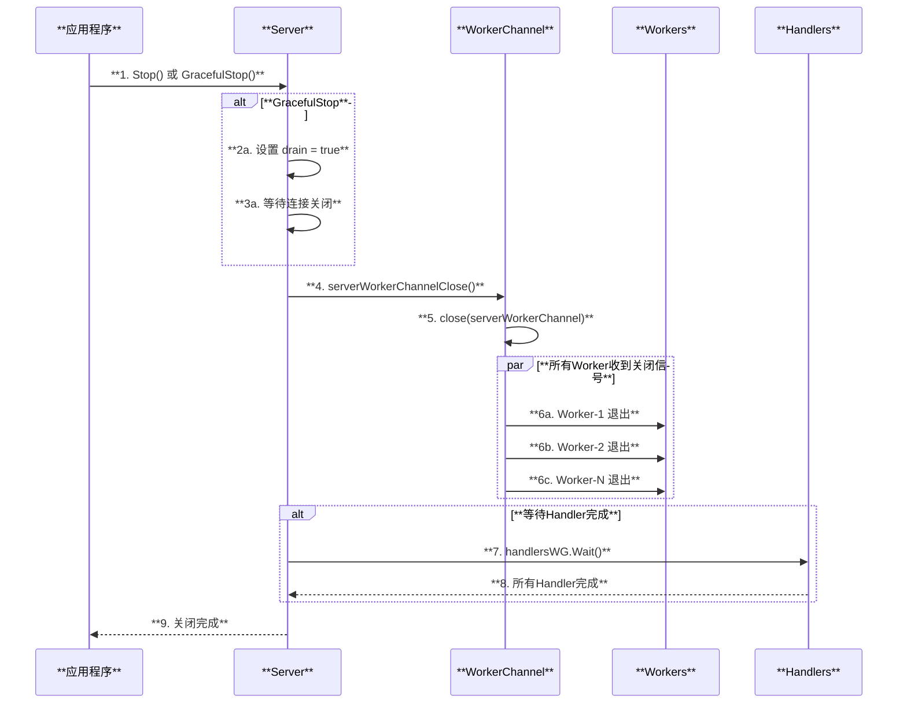

---

## 函数调用链

### 工作池初始化调用链

```
NewServer(opt ...ServerOption) - server.go:687
├── 应用选项
│   └── for _, o := range opt { o.apply(&opts) }
│       └── NumStreamWorkers(n) - server.go:618
│           └── opts.numServerWorkers = n
├── 创建 Server 结构
│   └── s := &Server{
│       opts: opts,
│       conns: make(map[string]map[transport.ServerTransport]bool),
│       services: make(map[string]*serviceInfo),
│       ...
│   }
└── 返回 Server

Serve(lis net.Listener) - server.go:840
├── 检查工作池配置
│   └── if s.opts.numServerWorkers > 0
├── 初始化工作池
│   └── s.initServerWorkers() - server.go:675
│       ├── 创建任务通道
│       │   └── s.serverWorkerChannel = make(chan func())
│       ├── 设置关闭函数（只执行一次）
│       │   └── s.serverWorkerChannelClose = sync.OnceFunc(func() {
│       │           close(s.serverWorkerChannel)
│       │       })
│       └── 启动 Worker 协程
│           └── for i := uint32(0); i < s.opts.numServerWorkers; i++ {
│                   go s.serverWorker()
│               }
└── 开始接受连接
    └── for { ... lis.Accept() ... }
```

### Worker 执行调用链

```
serverWorker() - server.go:662
├── 循环处理任务
│   └── for completed := 0; completed < serverWorkerResetThreshold; completed++
│       ├── 从通道接收任务
│       │   └── f, ok := <-s.serverWorkerChannel
│       │       └── ┌────────────────┬────────────────────────────────┐
│       │           │  返回值         │  说明                          │
│       │           ├────────────────┼────────────────────────────────┤
│       │           │  f (func)      │  要执行的处理函数               │
│       │           ├────────────────┼────────────────────────────────┤
│       │           │  ok (bool)     │  channel是否仍然打开            │
│       │           └────────────────┴────────────────────────────────┘
│       ├── 检查通道状态
│       │   └── if !ok { return }  // channel关闭，Worker退出
│       └── 执行任务
│           └── f()
│               └── 实际执行 handleStream()
└── 达到阈值后重生
    └── go s.serverWorker()
        └── ┌────────────────┬────────────────────────────────┐
            │  参数           │  值                            │
            ├────────────────┼────────────────────────────────┤
            │  阈值           │  serverWorkerResetThreshold    │
            │                │  = 1 << 16 = 65536             │
            ├────────────────┼────────────────────────────────┤
            │  目的           │  释放旧栈空间，防止栈无限增长    │
            └────────────────┴────────────────────────────────┘
```

### 任务分发调用链

```
serveStreams(ctx, st, rawConn) - server.go:1036
├── 设置连接上下文
│   └── ctx = transport.SetConnection(ctx, rawConn)
├── 创建流配额管理器
│   └── streamQuota := newHandlerQuota(s.opts.maxConcurrentStreams)
└── 处理流
    └── st.HandleStreams(ctx, func(stream *transport.ServerStream) {
            ├── 增加等待组计数
            │   └── s.handlersWG.Add(1)
            ├── 获取流配额
            │   └── streamQuota.acquire()
            ├── 构造处理函数
            │   └── f := func() {
            │           defer streamQuota.release()
            │           defer s.handlersWG.Done()
            │           s.handleStream(st, stream)
            │       }
            └── 分发任务
                └── if s.opts.numServerWorkers > 0 {
                        select {
                        case s.serverWorkerChannel <- f:
                            return  // Worker接收成功
                        default:
                            // channel满，回退到新goroutine
                        }
                    }
                    go f()  // 新建goroutine处理
        })
```

### handleStream 处理调用链

```
handleStream(st, stream) - server.go:1795
├── 解析方法名
│   └── sm := stream.Method()
│       service, method := parseMethod(sm)
├── 查找服务
│   └── srv, ok := s.services[service]
├── 统计调用开始
│   └── s.incrCallsStarted()
└── 根据类型处理
    ├── 找到 Unary 方法
    │   └── if md, ok := srv.methods[method]; ok
    │       └── s.processUnaryRPC(ctx, st, stream, srv, md)
    │           ├── 接收请求
    │           │   └── recvMsg(stream, codec, decomp)
    │           ├── 调用拦截器链
    │           │   └── s.opts.unaryInt(ctx, req, info, handler)
    │           ├── 调用实际处理器
    │           │   └── md.Handler(srv.serviceImpl, ctx, dec, interceptor)
    │           └── 发送响应
    │               └── s.sendResponse(ctx, stream, reply, cp, opts, comp)
    │
    └── 找到 Stream 方法
        └── if sd, ok := srv.streams[method]; ok
            └── s.processStreamingRPC(ctx, st, stream, srv, sd)
                ├── 创建 ServerStream 包装
                │   └── ss := &serverStream{...}
                ├── 调用拦截器链
                │   └── s.opts.streamInt(srv.serviceImpl, ss, info, handler)
                └── 调用实际处理器
                    └── sd.Handler(srv.serviceImpl, ss)
```

---

## 性能优化原理

### 栈复用优势

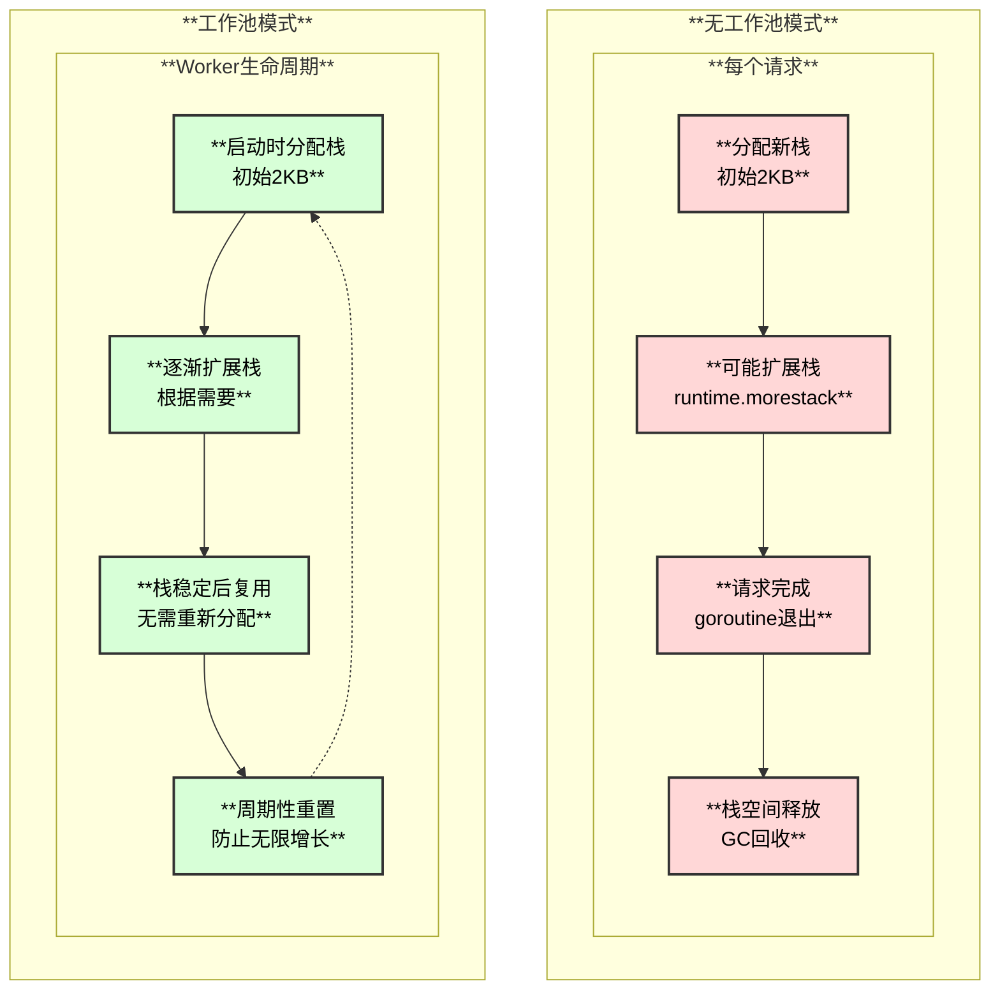

### 性能对比

| **指标** | **无工作池** | **有工作池** |
|---------|------------|-------------|
| **栈分配** | 每请求分配 | 复用现有栈 |
| **GC压力** | 高（频繁分配释放） | 低（长期复用） |
| **延迟稳定性** | 可能有毛刺 | 更稳定 |
| **内存使用** | 峰值高 | 更可控 |
| **适用场景** | 低QPS | 高QPS |

### 最佳实践建议

1. **Worker 数量设置**
   - 建议设置为 CPU 核心数的 1-2 倍
   - 过多会增加调度开销
   - 过少会回退到创建新 goroutine

2. **适用场景**
   - QPS > 1000 的高并发服务
   - 对延迟敏感的服务
   - 需要稳定内存使用的服务

3. **监控指标**
   - 观察 Worker channel 是否经常满
   - 监控 goroutine 数量是否稳定
   - 关注 GC 暂停时间

```go
// 示例配置
server := grpc.NewServer(
    grpc.NumStreamWorkers(uint32(runtime.NumCPU())),
    grpc.MaxConcurrentStreams(1000),
)
```

---

## 总结

gRPC-Go 服务端工作池通过以下机制提升性能：

1. **goroutine 复用**: 避免频繁创建和销毁 goroutine
2. **栈空间复用**: 减少 `runtime.morestack` 调用
3. **周期性重置**: 防止栈空间无限增长
4. **优雅降级**: 工作池满时自动回退到新 goroutine

这种设计在高并发场景下能显著提升性能和稳定性。

